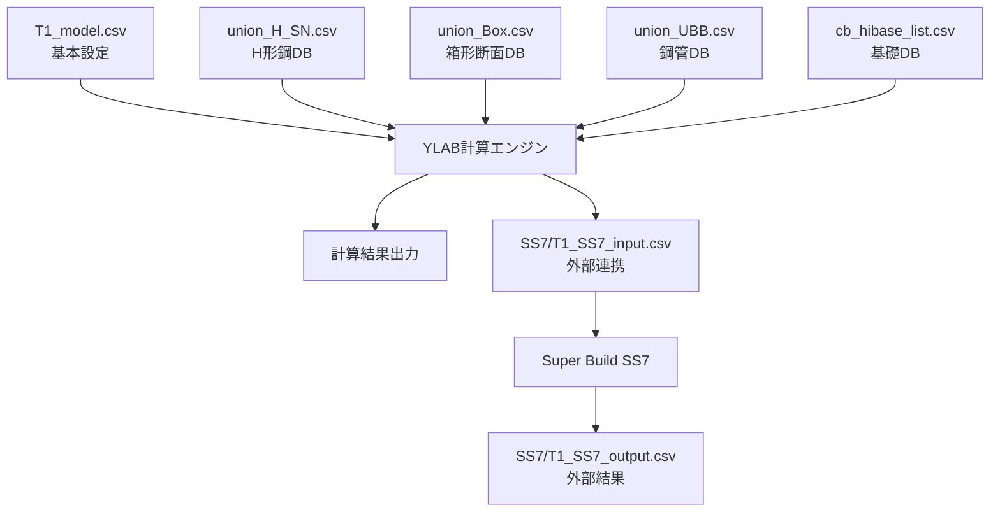

# YLAB入力データ仕様書

## 概要

YLABシステムで使用される入力データファイルの詳細仕様をまとめる。
鋼構造建築物の最適設計に必要な各種データファイルの構造、フォーマット、役割を定義する。

## ファイル分類

### 1. モデル定義ファイル (.csv)
建築物モデルの基本情報と計算条件を定義

### 2. 断面データベースファイル (union_*.csv)
使用可能な断面の寸法・性能データベース

### 3. 補助データファイル (.csv)
基礎、材料特性等の補助情報

### 4. 外部連携ファイル (.csv)
外部ソフトウェアとのデータ交換用

---

## 1. モデル定義ファイル

### 1.1 主要モデルファイル

#### T1_model.csv / T1R.csv
**役割**: 構造計算の基本条件とモデル設定
**エンコーディング**: Shift-JIS
**構造**: セクション化された設定項目

```
フォーマット:
name=セクション名,,,,,,,,,,,,,,,,,
項目名,値,パラメータ1,パラメータ2,パラメータ3,...
```

**主要セクション**:

##### 基本事項
```
name=基本事項
地下階数,0
PH階数,0
```

##### 構造計算条件  
```
name=構造計算条件
構造階高の自動計算,Y
自重の自動計算,Y,1,1    # Y/N,梁割増係数,柱割増係数
仕上荷重の考慮,Y
仕上S柱,0.00E+00       # 重量[N/mm²]
仕上S梁,0.00E+00       # 重量[N/mm²]  
仕上RC梁,5.00E-04      # 重量[N/mm²]
柱・梁せん断変形の考慮,Y
横座屈の考慮,Y
柱座屈長さ係数の自動計算,Y
スカラップの考慮,Y,35
支点浮き上がりの考慮,N
梁・柱面での断面算定,Y
床による梁剛性の考慮,1,1.3,1.5
ブレースの取り付き位置,1
曲げの設計におけるウェブの考慮（梁中央部）,N
曲げの設計におけるウェブの考慮（梁端部）,N
SN材H形鋼の幅厚比制限値の考慮,Y
保有耐力横補剛の事前処理,Y
保有耐力接合（仕口）の事前処理,Y
幅厚比の事前処理,Y
```

##### 最適化計算条件
```
name=最適化計算条件
do_parallel,Y
iter_set,1,10
maxiter_in_LS,400
maxcache,200
display,Iter
initial_penalty,0.2,0.3,0.3,0.3
```

**T1R.csvの特徴**:
- T1_model.csvの改良版
- 仕上荷重の自動計算機能を追加
- より詳細な構造計算条件設定

#### 設定項目詳細

##### 基本事項セクション

###### 地下階数
```csv
地下階数,<階数>
```
- **データ型**: `double` (非負整数)
- **デフォルト値**: 0
- **例**: `地下階数,0`

###### PH階数（ペントハウス階数）
```csv  
PH階数,<階数>
```
- **データ型**: `double` (非負整数)
- **デフォルト値**: 0
- **例**: `PH階数,0`

##### 構造計算条件セクション

###### 構造階高の自動計算
```csv
構造階高の自動計算,<Y/N>
```
- **フラグ**: Y（自動計算する）/ N（手動設定）
- **例**: `構造階高の自動計算,Y`

###### 自重の自動計算
```csv
自重の自動計算,<Y/N>,<梁割増係数>,<柱割増係数>
```
- **フラグ**: Y（有効）/ N（無効）
- **梁割増係数**: デフォルト: 1.0
- **柱割増係数**: デフォルト: 1.0
- **例**: `自重の自動計算,Y,1,1`

###### 仕上荷重の考慮
```csv
仕上荷重の考慮,<Y/N>
```
- **フラグ**: Y（考慮する）/ N（考慮しない）
- **例**: `仕上荷重の考慮,Y`

###### 仕上荷重の詳細設定
```csv
仕上S柱,<重量>
仕上S梁,<重量>
仕上RC梁,<重量>
```
- **単位**: N/mm² 
- **データ型**: `double`
- **科学的記数法**: 使用可能（例: 5.00E-04）
- **例**: 
  ```csv
  仕上S柱,0.00E+00
  仕上S梁,0.00E+00
  仕上RC梁,5.00E-04
  ```

###### 構造解析設定
```csv
柱・梁せん断変形の考慮,<Y/N>
横座屈の考慮,<Y/N>
柱座屈長さ係数の自動計算,<Y/N>
```

###### スカラップの考慮
```csv
スカラップの考慮,<Y/N>,<サイズ>
```
- **フラグ**: Y/N
- **サイズ**: スカラップサイズ [mm] (省略可能、デフォルト: 35)
- **例**: `スカラップの考慮,Y,35`

###### 基礎・断面算定設定
```csv
支点浮き上がりの考慮,<Y/N>
梁・柱面での断面算定,<Y/N>
```

###### 床剛性関連設定
```csv
床による梁剛性の考慮,<モード>,<係数1>,<係数2>
床によるS梁剛性の考慮,<モード>,<係数1>,<係数2>
床によるRC梁剛性の考慮,<モード>,<係数1>,<係数2>
```
- **モード**: 床剛性考慮モード（PRM定数）
- **係数1, 係数2**: 直接指定時の合成係数

###### ブレース設定
```csv
ブレースの取り付き位置,<位置コード>
```
- **位置コード**: PRM定数による位置指定

###### 設計詳細設定
```csv
曲げの設計におけるウェブの考慮（梁中央部）,<Y/N>
曲げの設計におけるウェブの考慮（梁端部）,<Y/N>
SN材H形鋼の幅厚比制限値の考慮,<Y/N>
```

###### 事前処理設定
```csv
保有耐力横補剛の事前処理,<Y/N>
保有耐力接合（仕口）の事前処理,<Y/N>
幅厚比の事前処理,<Y/N>
```

##### 最適化計算条件セクション

###### 並列処理設定
```csv
do_parallel,<Y/N>
```

###### イテレーション設定
```csv
iter_set,<開始>,<終了>
```
- **例**: `iter_set,1,10`

###### 最適化パラメータ
```csv
maxiter_in_LS,<最大イテレーション数>
maxcache,<キャッシュサイズ>
display,<表示レベル>
```
- **表示レベル**: None, Iter10, Iter, Final

###### ペナルティ係数
```csv
initial_penalty,<Phase1>,<Phase2>,<Phase3>,...
```
- **例**: `initial_penalty,0.2,0.3,0.3,0.3`

##### 鉛直ブレース断面（メーカー製品）
```csv
name=鉛直ブレース断面（メーカー製品）
<断面符号>,<断面リスト名>,<V1変数名>,<V2変数名>
```
- **概要**: メーカー規格のBRBを断面リストから選択する入力。
- **事前条件**: 「断面リスト」でBRB用リストを登録済みであること。
  例: `UBB標準 → data/union_UBB.csv`（種別は
  〈アンボンドブレース(耐震)〉）。
- **入力列定義**:

| 項目         | 意味                         | 単位 | 備考 |
|--------------|------------------------------|------|------|
| 断面符号     | 断面の識別名                 | -    | 例: BRB-1 |
| 断面リスト名 | 登録済みの断面リスト名       | -    | 例: UBB標準 |
| V1変数名     | 設計変数名（BRB V1=種別）    | -    | 例: vtype：未定義は自動追加、候補はリストから推定 |
| V2変数名     | 設計変数名（BRB V2=降伏軸力）| tonf | 例: vny：候補はリストから推定 |
- **備考**: 断面積Aや限界座屈長Lkmax等は断面リストから取得する。
- **例**:
  ```csv
  name=鉛直ブレース断面（メーカー製品）
  BRB-1,UBB標準,vtype,vny
  BRB-2,UBB標準,vtype,vny
  ```

##### 水平ブレース断面
```csv
name=水平ブレース断面
<断面符号>,<A[mm²]>,<E[N/mm²]>,<単位容積重量[N/mm³]>
```
- **概要**: 水平ブレースの材料特性を直接指定する入力。
- **入力列定義**:

| 項目           | 意味           | 単位    | 備考 |
|----------------|----------------|---------|------|
| 断面符号       | 断面の識別名   | -       | 例: HB-1 |
| A              | 断面積         | mm²     | 計算でA,Awとして使用 |
| E              | ヤング係数     | N/mm²   | - |
| 単位容積重量   | 単位容積重量   | N/mm³   | 空欄可 |
- **例**:
  ```csv
  name=水平ブレース断面
  HB-1,5000,2.05E+05,7.70E-05
  HB-2,6500,2.05E+05,
  ```

### 1.2 コストモデルファイル

#### S4_cost.csv
**役割**: コスト計算に関する設定
**用途**: 経済性を考慮した最適化

---

## 2. 断面データベースファイル

### 2.1 H形鋼データベース

#### union_H_SN.csv (SN材H形鋼)
#### union_H_SS.csv (SS材H形鋼)

**構造**:
```
ヘッダー: label,type,symbol,H,B,tw,tf,r
データ例: ,ハイパービーム,HY,400,200,9,12,13
```

**項目定義**:
| 項目 | 意味 | 単位 | 備考 |
|------|------|------|------|
| label | 断面ラベル | - | 通常空白 |
| type | 断面タイプ | - | ハイパービーム等 |
| symbol | 断面記号 | - | HY, H等 |
| H | 断面高さ | mm | フランジ間距離 |
| B | フランジ幅 | mm | フランジ全幅 |
| tw | ウェブ厚 | mm | ウェブ板厚 |
| tf | フランジ厚 | mm | フランジ板厚 |
| r | フィレット半径 | mm | ウェブ-フランジ接続部 |

### 2.2 箱形断面データベース

#### union_Box.csv

**構造**:
```
ヘッダー: label,type,symbol,D,t,r
```

**項目定義**:
| 項目 | 意味 | 単位 | 備考 |
|------|------|------|------|
| D | 外径 | mm | 断面外形寸法 |
| t | 厚さ | mm | 板厚 |
| r | 半径 | mm | コーナー半径 |

### 2.3 鋼管断面データベース

#### union_UBB.csv

**構造**:
```
ヘッダー: label,type,symbol,D,t,shape,material,A,Lkmax,rho
```

**項目定義**:
| 項目 | 意味 | 単位 | 備考 |
|------|------|------|------|
| D | 管径 | mm | 外径 |
| t | 管厚 | mm | 肉厚 |
| shape | 断面形状 | - | 丸管等 |
| material | 材料 | - | SN400, SS400等 |
| A | 断面積 | cm² | 有効断面積 |
| Lkmax | 最大座屈長 | mm | 座屈設計用 |
| rho | 単位重量 | kg/m | 線密度 |

---

## 3. 補助データファイル

### 3.1 基礎関連データベース

#### cb_hibase_list.csv

**役割**: ハイベース（基礎製品）データベース
**構造**:
```
ヘッダー: type,name,D,kbs,Df
データ例: ハイベースNEO,EB150-4-24,150,1.55E+06,4.50E+05
```

**項目定義**:
| 項目 | 意味 | 単位 | 備考 |
|------|------|------|------|
| type | 製品タイプ | - | ハイベースNEO等 |
| name | 製品名 | - | 型番 |
| D | 外径 | mm | 基礎外径 |
| kbs | バネ定数 | N/mm | 科学的記数法 |
| Df | 設計荷重 | N | 許容荷重 |

---

## 4. 外部連携ファイル

### 4.1 SS7連携ファイル

#### SS7/T1_SS7_input.csv
**役割**: Super Build SS7への入力データ
**内容**: 
- 工事基本情報
- 構造スパン情報
- 構造階高情報

#### SS7/T1_SS7_output.csv
**役割**: Super Build SS7からの出力データ
**内容**:
- 計算結果
- 構造詳細データ

---

## データフォーマット仕様

### 文字エンコーディング
- **標準**: Shift-JIS
- **注意**: UTF-8での保存は文字化けの原因となる
- **読み込み**: MATLABの`readtable`関数使用、`detectImportOptions`で自動判別

### 数値表現
- **小数点**: ピリオド（.）使用
- **指数表記**: E記法使用（例: 1.55E+06, 1.28E+11）
- **単位**: SI単位系ベース（mm, N, kg等）
- **大きな数値**: バネ定数等は指数表記推奨（例: 14000000000 → 1.4E+10）

### 論理値表現
- **真**: Y
- **偽**: N

### 区切り文字
- **CSV区切り**: カンマ（,） 
- **複数パラメータ**: カンマ区切りで同一行に配置
- **コメント**: %記号で行コメント可能

### MATLAB読み込み設定
```matlab
opts = detectImportOptions(file_);
opts.Delimiter = {','};
opts.CommentStyle = '%';
opts.VariableNamingRule = 'preserve';
list_ = readtable(file_, opts);
```

---

## ファイル間依存関係



## 使用例

### 基本的な実行コマンド
```matlab
install  % パス設定
YLAB('uimode', 'CUI', 'inputfile', 'data/T1_model.csv', 'outputfile', 'out/T1_result.csv')
```

### 実データでのテスト例
```matlab
% T1Rモデルでの最適化実行
YLAB('uimode', 'CUI', '-nopdf', 'exemode', 'CHECK', ...
     'inputfile', 'data/T1R.csv', 'outputfile', 'out/T1R_output.csv')
```

### 断面データベースの活用例
```matlab
% H形鋼SN材の断面一覧を取得
secList = SectionListHandler();
secList.loadSectionDatabase('union_H_SN.csv');
availableSections = secList.getSectionList(1); % リストID=1
```

### データ構造の実例

#### ハイベースデータの実際の値
```csv
type,name,D,kbs,Df
ハイベースNEO,EB150-4-24,150,14000000000,500
ハイベースNEO,GB350-4-42,350,1.28E+11,740
```

#### H形鋼データの実際の値  
```csv
label,type,symbol,H,B,tw,tf,r
,ハイパービーム,HY,400,200,9,12,13
,ハイパービーム,HY,450,250,9,16,13
```

### モデル変更時の注意点
1. **エンコーディング保持**: Shift-JISで保存
2. **数値精度**: 科学的記数法の桁数に注意  
3. **設定の整合性**: Y/Nフラグと関連パラメータの対応確認
4. **バネ定数の表記**: 大きな値は指数表記推奨（1.28E+11等）

---

## トラブルシューティング

### よくある問題

#### 1. 文字化け
**原因**: UTF-8での保存
**解決**: Shift-JISで再保存

#### 2. 数値エラー
**原因**: 指数表記の形式誤り
**解決**: E記法の確認（1.55E+06形式）

#### 3. 設定無効
**原因**: Y/Nフラグとパラメータの不整合
**解決**: 論理値とその関連パラメータの対応確認

---

## 更新履歴

- 2025-07-31: 初版作成
- Phase 1完了に伴う入力データ仕様整理
- SectionPropertyCalculator対応確認済み
- 基本事項・構造計算条件・最適化条件の詳細仕様を統合

---

**注意**: この仕様書はPhase 1完了時点での情報に基づく。
今後のPhase 2以降の開発により、新たな入力データ要件が追加される可能性がある。
